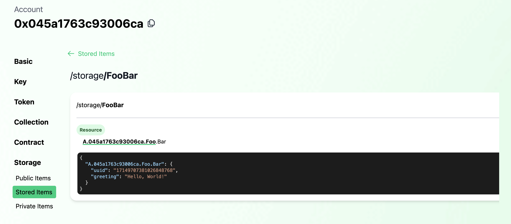

# Tour of Flow's Account Model

> Get acquainted with various features of accounts on [Flow](www.flow.com)

## Progressive Walkthroughs

> :information_source: If you plan on following along with the walkthroughs below, be sure to install [Flow
> CLI](https://github.com/onflow/flow-cli) via [these installation
> instructions](https://developers.flow.com/tools/toolchains/flow-cli/install).

## Account Creation

Creating an account on Flow must be initialized by an existing account. This is because Flow accounts are not derived
from keys, but are objects that exist onchain - special objects which verified signatures allow access to.

Of course, to interact with the chain, one needs an account, thus you'll need a genesis account. This can be done easily
via the Flow CLI. Firstly, let's spin up our localnet

```sh
flow emulator
```

Then we can create our account with the following command:

```sh
flow accounts create
```

After which you can name your account. Let's name ours `genesis-emulator`

```sh
Enter an account name: genesis-emulator
```

Select `Emulator` as our network, and we have a new account on our local emulator network. Easy enough, but to better
understand what just happened, let's take a closer look at an account creating transaction.

In [1_create_account.cdc](./transactions/account-creation/1_create_account.cdc), we see that account
creation is actually very simple:

```cadence
/// Creates a new account, funding creation via the signing account
///
transaction(originatingPublicKey: String) {
    prepare(signer: AuthAccount) {
        let newAccount: AuthAccount = AuthAccount(payer: signer)

        // Create a public key for the proxy account from the passed in string
        let key: PublicKey = PublicKey(
            publicKey: originatingPublicKey.decodeHex(),
            signatureAlgorithm: SignatureAlgorithm.ECDSA_P256
        )

        // Add the key to the new account
        signer.keys.add(
            publicKey: key,
            hashAlgorithm: HashAlgorithm.SHA3_256,
            weight: 1000.0
        )
    }
}
```

We're simply creating a new account object by funding its creation with a bit of FLOW. This is done a/ as spam
prevention and b/ to provide a seed amount of FLOW to fund initial transactions and a minimal amount of storage.

But the new account isn't very useful if we can't access it with keys. So when we run the transaction, the provide a
public key string is added to new account.

> :information_source: Note the `weight` field is set to 1000.0. Since Flow account natively support multisig, we can
> add any arbitrary weight between 0.0 and 1000.0. When a transaction is verified, the signing weights must add up to
> 1000.0. This means any combination of key weights can be used to authorize a transaction so long as the signing key
> weights sum to 1000.0.

Of course, before running the transaction, we make sure to generate a corresponding private key which we custody in
order to sign future transactions.

Enough analyzing, let's create the account!

1. As we mentioned, account creation requies some seeded FLOW. Before proceed, we'll need to get some Flow for our
   genesis account so let's transfer some quickly.

    ```sh
    flow transactions send ./transactions/account-creation/0_transfer_flow.cdc 10.0 0xe03daebed8ca0615
    ```

1. Generate a key pair

    ```sh
    flow keys generate
    ```

    This will create an ECDSA_P256 key pair and output it for use in the next step:


    ```sh
    Private Key              a3b9eecaa7c6f9cb5446d3cb388d5910f0c4ece0098c712a91765830d9ba1d6b 
    Public Key               a3802c78bf42a92a6ccb0a0742b57799d0b754442c50b9f44bfaa3ca786fcb65b99d6ec6f0828a728ef7c6a48c7f51b3c206f722ba08701273c5aa717fd8dc49 
    Mnemonic                 oak play symptom warm mushroom someone fog unfold put inherit love labor 
    Derivation Path          m/44'/539'/0'/0/0 
    Signature Algorithm      ECDSA_P256
    ```

1. Create the account and add the generated public key

    ```sh
    flow transactions send ./transactions/account-creation/1_create_account.cdc \
        a3802c78bf42a92a6ccb0a0742b57799d0b754442c50b9f44bfaa3ca786fcb65b99d6ec6f0828a728ef7c6a48c7f51b3c206f722ba08701273c5aa717fd8dc49 \
        --signer genesis-emulator
    ```

    We'll see a number of events emitted, including `Flow.AccountCreated`

    ```sh
    Index       5
    Type        flow.AccountCreated
    Tx ID       cb470b2ea4acf8b726faab5f85c1f56ceae1b5ba2e3e3bed706d26a512be3c46
    Values
                - address (Address): 0x045a1763c93006ca 
    ```

1. Add the new account to our config `flow.json` so we can sign transactions with it. Since we'll later deploy a
   contract named `Foo` to this account, we'll name the account `foo-emulator` in our config. Your `accounts` field
   should look like:

    ```json
    "accounts": {
        "emulator-account": {
            "address": "f8d6e0586b0a20c7",
            "key": "df3ade1ad99aa8e2574171fd9e1b80169647b2771b7743d9910d777237778a61"
        },
        "emulator-flow": {
            "address": "0ae53cb6e3f42a79",
            "key": "686779d775e5fcbf8d2f4a85cb4c53525d02b7ef53230d180fc16f35d9b7d025"
        },
        "emulator-ft": {
            "address": "ee82856bf20e2aa6",
            "key": "686779d775e5fcbf8d2f4a85cb4c53525d02b7ef53230d180fc16f35d9b7d025"
        },
        "genesis-emulator": {
            "address": "e03daebed8ca0615",
            "key": "6a6fee08c0b9fc590f0fa5c596e92f042258c47b91db17ea51c57db47e2229c7"
        },
        "foo-emulator": {
            "address": "0x045a1763c93006ca",
            "key": "a3b9eecaa7c6f9cb5446d3cb388d5910f0c4ece0098c712a91765830d9ba1d6b"
        }
    }
    ```

    Notice that we added the private key paired with the public key we used for account creation.

That's it for this section! So far, we've:

- Generated a public/private key pair
- Created a new account
- Added the generated key to the new account
- Added the new account to our project's config so we can sign future transactions.

To inspect the account visually, we can user Flowview. With your emulator still running, go to
[emulator.flowview.app](https://emulator.flowview.app/) and search for the account we created - `0x045a1763c93006ca`.
You'll see a number of options on the left sidebar, but click on "Key" and you'll see the key we added in the creation
transactions.


Flowview is a great way to inspect various attributes on Flow accounts, and we'll use it more in a bit.

Let's now use this account to deploy a contract and explore account storage and Capabilities.

## Contract Deployment & Account Capabilities

### Contract Deployment

Contrary to other blockchain platforms, there is only one class of account on Flow. User accounts can be handled the
same as accounts that host contracts.

As a Flow developer, this means you don't need to concern yourself with disparate security concerns based on whether a
user or contract account is interacting with your smart contracts - just focus on proper logic and access controls. As a
savy end user, this means you can even expand the set of functions available on your account by creating and deploying
your own contracts to it!

Let's get started by deploying the simple [`Foo` contract](./contracts/Foo.cdc)

We're going to add `Foo` to emulator deployments in our `flow.json` project config. Your deployments section should look
as follows:

```json
"deployments": {
    "emulator": {
        "emulator-account": [
            "PettyCash"
        ],
        "emulator-flow": [
            "FlowToken"
        ],
        "emulator-ft": [
            "FungibleToken"
        ],
        "foo-emulator": [
            "Foo"
        ]
    }
}
```

From here, we can add the contract to the `foo-emulator` account with the following command:

```sh
flow accounts add-contract ./contracts/Foo.cdc --signer foo-emulator
```

This sends a transaction that adds the `Foo` contract to the `foo-emulator` account. What does this transaction look
like? I'm glad you asked!

```cadence
transaction(name: String, code: String ) {
    prepare(signer: AuthAccount) {
        signer.contracts.add(name: name, code: code.decodeHex())
    }
}
```

The line doing all the magic is `signer.contracts.add(name: name, code: code.decodeHex())`. As you can imagine, the
`code` passed in the transaction is added to the signing account's `contracts` under the given `name`. Simple enough!

And if we look again at the account on [Flowview](https://emulator.flowview.app/account/0x045a1763c93006ca/contract), we
can see that `Foo` has been deployed to the account (under "Contracts").

We now know what contract deployment looks like, but what contract did we just deploy?

Without getting too sidetracked into the details of contracts on Flow, `Foo` defines a simple resource named `Bar` with
the following interface:

```cadence
/* --- Bar --- */
//
/// Simple queryable public interface
///
pub resource interface BarPublic {
    pub view fun getGreeting(): String
}

/// Simple resource containing a greeting mutable by its owner
///
pub resource Bar : BarPublic {
    /// The contained greeting string
    access(self) var greeting: String

    /* BarPublic Conformance */
    //
    /// Retrieves the contained greeting, also emitting the `Greeting` event
    /// Note: You wouldn't normally emit an event in a getter method, but it's done here for demonstration purposes
    ///
    pub view fun getGreeting(): String

    /* Resource Owner Functionality */
    //
    /// Sets the contained greeting, emitting the `GreetingSet` event
    ///
    pub fun setGreeting(_ greeting: String)
}
```

You can see `Bar` has a `greeting` with a getter & setter method. `Bar` implements the `BarPublic` interface which
exposes a subset of the fully implemented functionality, providing access only to the getter `getGreeting()` which
returns a `String`.

### Account Capabilities

But what does this have to do with accounts? Well, accounts on Flow are not simply mechanisms for verifying transaction
approval. Accounts enable state storage on Flow with both publicly and privately accessible namespace. So, as you
can imagine, if `Bar` is stored in an account, we'd want the setter accessible privately. However, exposing `BarPublic`
in the publicly accessible namespace would enable anyone to reference the underlying `Bar` resource while preserving
`greeting` mutability access controls to `Bar`'s owner.

And this is exactly what we configure in the contract's initialization:

```cadence
init() {
    // Set contract fields
    self.StoragePath = /storage/FooBar
    self.PublicPath = /public/FooBar

    // Configure the deployment account with a Bar resource
    self.account.save(<-create Bar(), to: self.StoragePath)
    self.account.link<&{BarPublic}>(self.PublicPath, target: self.StoragePath)
}
```

We set the contract fields, in this case canonical paths, then proceed to configure the deployment account with a new
`Bar` resource in storage and a publicly accessible `BarPublic` Capability.

Since we've already deployed this contract, we can inspect the account again in Flowview and confirm the configuration.
Sure enough in the deployment account's storage, we see the `Bar` resource stored with it's greeting as set on init.



And in "Public Items", we see that the `Bar` resource in storage is linked as a `BarPublic` Capability.


We can query against that `BarPublic` Capability to retrieve the greeting by running the following script:

```sh
flow scripts execute ./scripts/foo/get_greeting.cdc 
```

Which returns `"Hello, World!"` As defined in the contract, this greeting is mutable by `Bar`'s owner so we could change
it if we want to. Let's send a transaction to do just that.


```sh
flow transactions send ./transactions/foo/set_greeting.cdc 'Hello, Universe!' \
    --signer foo-emulator
```

And if we run the preceding script (or inspect in Flowview), we can see the greeting has changed to the one we set.


### Recap

So far we've:

- Created a new account and added a full weight key
- Deployed a contract
- Explored account storage
- Used a public Capability
- Mutated a resource field in account storage
- Visually inspected account keys, deployed contracts, storage and Capabilities using Flowview

Pretty great start so far! But this is just scratching the surface of Flow's account model. Capabilities unlock all
sorts of amazing use cases. Next, we'll use Capabilities to delegate access to the entire account object.

## Adding Custom Account Functionality

### `PettyCash` Contract Overview

We'll explore adding custom functionality to accounts with contracts and their defined resources.

In the [`PettyCash` contract](./contracts/PettyCash.cdc), we define an `Allowance` resource which enables withdrawals
from a FungibleToken Vault up to a defined limit. The owner of the `Allowance` keeps it in their account and can reset
the limit to any amount at any time.

On contract initialization, an `Allowance` is configured in the deploying account ready to set a limit and issue to a
recipient.

But an allowance typically has a recipient, so we also define a `Recipient` which maintains a Capability on the
`Allowance`. When the actual recipient of the allowance wants to access their funds, they can withdraw from the source
account's FungibleToken Vault, but only up to the amount specified in the `Allowance` resource regardless of how many
funds are actually available in the underlying FungibleToken Vault.

This is a great illustration of the power of not only composabile standards, but also of how the abstracted account
model on Flow unlocks powerful customization of user accounts via Capability-based security on contract-defined
resources.

### Walkthrough

#### Contract Deployment

As before, we'll want to deploy the `PettyCash` contract. We can deploy it to the `foo-emulator` account. Last time,
we added the contract to our deployment, but this time let's use the Flow CLI command:

```sh
flow accounts add-contract ./contracts/PettyCash.cdc --signer foo-emulator
```

Inspecting the account again in Flowview, we see that the contract has been deployed.


#### Transfer FLOW

Before we set a limit on `Allowance`, we of course need to make sure the underlying account has FLOW in its Vault. So
let's transfer some FLOW to `foo-emulator`:

```sh
flow transactions send ./transactions/account-creation/0_transfer_flow.cdc 10.0 0x045a1763c93006ca
```

#### Setting `Allowance.limit`

On deployment, the account is configured with an `Allowance` resource with a starting limit of 0.0. The owner of that
resource, in this case `foo-emulator`, can update that limit. Let's go ahead and do that:

```sh
flow transactions send ./transactions/petty-cash/0_set_allowance_limit.cdc 5.0 --signer foo-emulator
```

Querying for `Allowance.limit`, we can see the change took effect.

```sh
flow scripts execute ./scripts/petty-cash/get_remaining_allowance.cdc 0x045a1763c93006ca
```

#### Publish `Allowance` Capability

Now that we have the `Allowance` configured, we can issue a private Capability for use by another account.

This can be done either in a multi-signed transaction where both the `Allowance` owner and the recipient both sign the
transaction, or we can use the `AuthAccount.Inbox` to first publish the Capability for the recipient to claim in a
later transaction.

The `Inbox` is a useful feature for issuing private Capabilities, so let's see what that
[transaction](./transactions/petty-cash/1_publish_recipient.cdc) looks like.

```cadence
transaction(recipientAddress: Address) {
    prepare(signer: AuthAccount) {
        let allowanceCapability = signer.getCapability<&{PettyCash.AllowancePublic, FungibleToken.Provider}>(
                PettyCash.RecipientPrivatePath
            )
        assert(allowanceCapability.check(), message: "Invalid Allowance Capability")
        signer.inbox.publish(allowanceCapability, name: "FlowTokenAllowance", recipient: recipientAddress)
    }
}
```

Given some recipient Address, we retrieve the desired Capability and ensure its validity. Lastly, we call
`inbox.publish`, providing the Capability, a name, and the recipient who can later claim the provided Capability.

Let's now run that transaction, providing the default `emulator-account` address as recipient:

```sh
flow transactions send ./transactions/petty-cash/1_publish_recipient.cdc 0xf8d6e0586b0a20c7 --signer foo-emulator
```

#### Claiming a Published Capability

With the Capability published, the recipient can now claim and save it to their account. Before we do, we'll take a look at the claim transaction:

```cadence
transaction(issuerAddress: Address) {
    prepare(signer: AuthAccount) {
        // Claim the published Capability
        let allowanceCapability = signer.inbox.claim<&{PettyCash.AllowancePublic, FungibleToken.Provider}>("FlowTokenAllowance", provider: issuerAddress)
            ?? panic("No Allowance Capability to claim")

        // Create a new Recipient to store the claimed Capability & save in storage
        let newRecipient: @PettyCash.Recipient <- PettyCash.createNewRecipient(sourceAllowance: allowanceCapability)
        signer.save(<-newRecipient, to: PettyCash.RecipientStoragePath)
    }
}
```

The relevant line is:

```cadence
signer.inbox.claim<&{PettyCash.AllowancePublic, FungibleToken.Provider}>("FlowTokenAllowance", provider: issuerAddress)
```

Where the signer calls on their inbox to claim the typed Capability from the listed provider under the given name. The
rest of the transaction above sticks the claimed Capability in a `Recipient` resource and saves it to storage.

So let's run this transaction before finally withdrawing the allowed funds.

```sh
flow transactions send ./transactions/petty-cash/2_claim_and_configure_recipient.cdc 0x045a1763c93006ca 
```

> :information_source: Since we're using Emulator, we don't need to list a signer as `emulator-account` is the default
> signer for our local network.

Checking out `emulator-account` on
[Flowview](https://emulator.flowview.app/account/0xf8d6e0586b0a20c7/storage/PettyCashRecipient), we see that the
`Recipient` has been configured.


#### Using `Recipient` to withdraw funds

Finally, we can withdraw allowed funds via the configured `Recipient` in `emulator-account`. In this transaction, the
funds will be withrawn from `foo-emulator`'s FLOW vault - the same one used to pay for transactions and rent storage. 

However, access via the `Recipient` is gated by the logic defined in `PettyCash`, meaning the withdrawal limit cannot
exceed that set in `Allowance`.

In fact, we can try to withdraw over the limit we set previously and watch the transaction fail.

```sh
flow transactions send ./transactions/petty-cash/3_withdraw_allowance_from_recipient.cdc 5.1
```

```sh
error: pre-condition failed: Cannot withdraw more than the allowance limit
  --> 045a1763c93006ca.PettyCash:59:16
   |
59 |                 self.withdrawn + amount <= self.limit: "Cannot withdraw more than the allowance limit"
   |    
```

So let's withdraw the known limit of 5.0 FLOW:

```sh
flow transactions send ./transactions/petty-cash/3_withdraw_allowance_from_recipient.cdc 5.0
```

Try to withdraw again, and you'll see that the transaction fails because we've reached the withdrawal limit.

## Account Linking

> :information_source: For more info on account linking, check out Flow's [Account Linking home
> page](https://flow.com/account-linking)

Capabilities enable access to a set of functionality on those objects they target. However, Capabilities are not
limitted to targetting resources, but can also target account objects themselves.

This means there are two ways to access accounts in Flow. You can either custody a key for the account you're trying to
access and sign transactions authorizing you to access the account object and its contents or you can access the account
via a Capability.

Account access via Capabilities opens the door to all sorts of unique applications. Accounts can store Capabilities on
other accounts, enabling a network of linked accounts. Or, think of a contract that creates any number of accounts and
maintains access to those accounts via Capabilities. Alternatively, we can have onchain equivalents of multisig schemes,
allowing us to assign role-based access or time-restricted or other conditional logic.

